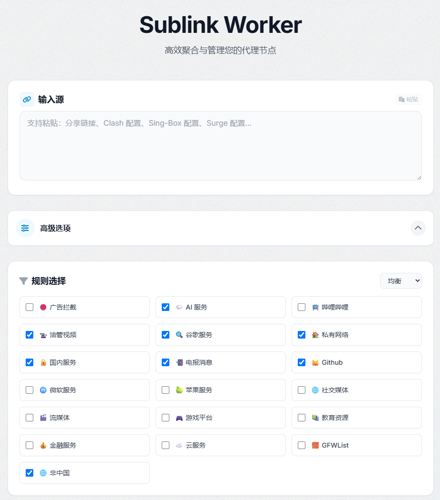

  

  <h1><b>Sublink Worker</b></h1>
  <h5><i>One Worker, All Subscriptions</i></h5>

  
<b>A lightweight subscription converter and manager for proxy protocols, deployable on Cloudflare Workers, Vercel, Node.js, or Docker.</b>

  
<i>Fork of <a href="https://github.com/7Sageer/sublink-worker">7Sageer/sublink-worker</a> with AnyTLS support and custom rule defaults.</i>

  

    <a href="./README.md">English</a> | <b>中文</b>
  

   

  

  

## 🚀 在线试用

部署前想先体验一下？访问在线实例直接试用：

**👉 [https://sublink-worker.nortons.workers.dev/](https://sublink-worker.nortons.workers.dev/)**

欢迎在浏览器中直接测试订阅转换、规则自定义以及所有支持的协议（SS/VMess/VLESS/AnyTLS/Hysteria2/Trojan/TUIC），无需安装任何环境。

### 网页界面预览

*Sublink Worker 网页界面 — 订阅输入、规则选择与输出生成*

## 相较上游的改动

### AnyTLS 协议支持
- 新增 `anytls://` 协议解析器。AnyTLS 链接会被正确解析并转换为 Clash / Sing-Box 的原生 AnyTLS 节点，不再被静默丢弃。
- AnyTLS 结构与 VLESS 相同（UUID@Host:Port?TLS 参数），但使用 `type: anytls` 和 `password` 字段，在 Clash Meta 和 Sing-Box 中是独立的协议类型。

### 多订阅合并修复
- **禁用 proxy-provider**：返回 Clash YAML 格式的订阅不再被自动转为 `proxy-providers`。所有订阅的节点全部内联合并到最终配置中，避免因 UA 限制或 Token 鉴权导致的运行时拉取失败。
- **Proxy-groups 隔离**：订阅源自带的 `proxy-groups` 不再合并到输出配置中。只有你在 Web 界面勾选的规则分组才会出现。

### 自定义规则默认值（白名单模式）
- **非中国** 和 **漏网之鱼** 默认走 **DIRECT（直连）** 而非节点选择。
- 新增 **GFWList** 规则（基于 `geosite:category-gfw`），默认走 **节点选择（代理）**。
- **GFWList 自动合并**：当仅勾选 GFWList 而未勾选社交媒体/谷歌/油管/Github 时，自动拉入 `twitter/google/youtube/github/gitlab` 等规则集。解决 `x.com` 等在 v2fly 中被归入 `geosite:twitter` 而非 `category-gfw` 导致漏网的问题。
- 规则优先级：具体规则（Google、Telegram、Github...）> GFWList > 非中国（直连）> 漏网之鱼（直连）。
- 实现白名单代理模式：仅被 GFW 封锁的域名走代理，其余全部直连。

### 支持的协议
ShadowSocks、VMess、VLESS、**AnyTLS**、Hysteria2、Trojan、TUIC

### 支持的客户端
Sing-Box、Clash (Meta/Mihomo)、Xray/V2Ray、Surge

## 快速开始

### 一键部署
- 点击上方的 "Deploy to Cloudflare Workers" 按钮
- 更多信息请参阅上游[文档](https://sublink.works/guide/quick-start/)

### 其他运行时
- **Node.js**: `npm run build:node && node dist/node-server.cjs`
- **Vercel**: `vercel deploy`（在项目设置中配置 KV）
- **Docker**: `docker pull ghcr.io/7sageer/sublink-worker:latest`
- **Docker Compose**: `docker compose up -d`（包含 Redis）

## 核心功能
- 从多个来源导入订阅（内联合并，不使用 proxy-provider）
- 生成固定/随机短链接（基于 KV）
- 明暗主题切换
- 灵活的 API，支持脚本自动化
- 多语言支持（中文、英语、波斯语、俄语）
- Web 界面，提供预定义规则集和可自定义的策略组

## 上游文档

- [在线演示](https://app.sublink.works)
- [中文文档](https://sublink.works)
- [英文文档](https://sublink.works/en/)
- [API 参考](https://sublink.works/api/)
- [常见问题](https://sublink.works/guide/faq/)

## 许可证

本项目基于 MIT 许可证 - 详见 [LICENSE](LICENSE) 文件。
